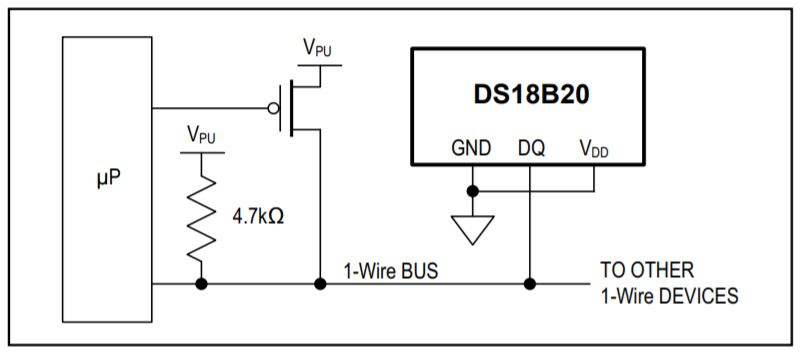
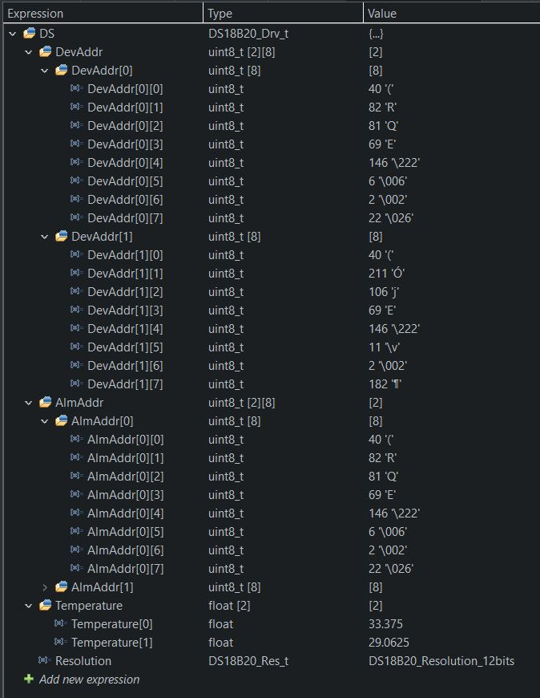

<h1>DS18B20 digital thermometer</h1>

STM32 I2C HAL & LL library for the 1-Wire DS18B20

These digital sensors provide 9 to 12-bit (configurable) temperature readings and High/Low temperature alarm

In parasite mode the sensor derives its power from the data line. Only two wires, Data and GND are required.

This library need to used DwtDelay library as some waiting time need to be in microsecond

Tested on STM32H750 with 2x DS18B20 with alarm trigger

Data are store in data structure

Comment/Suggestion are highly welcome!
